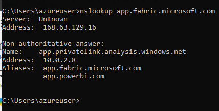
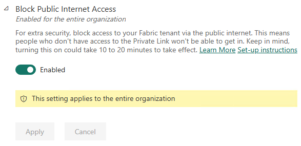
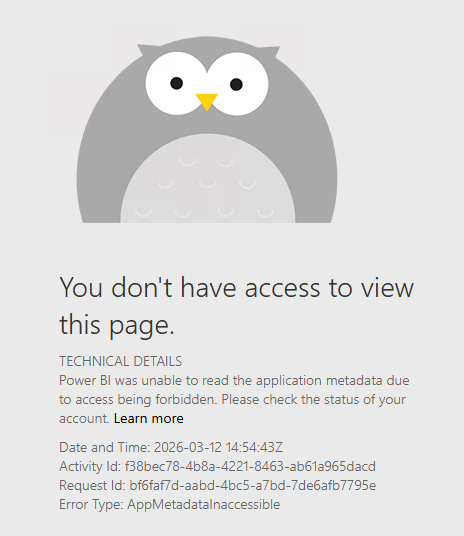
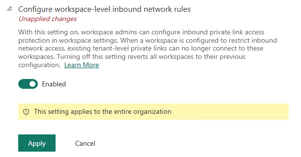
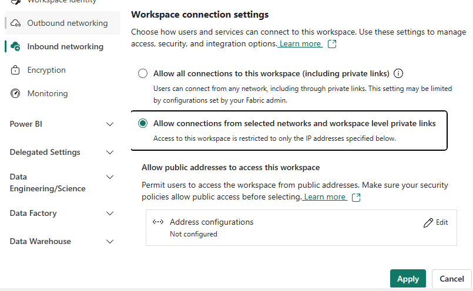
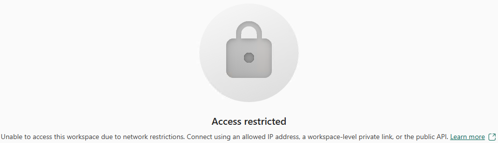

# Screenshots for inbound control configuration

## Tenant-level private endpoints and Internet restrictions

Resolution for `app.fabric.microsoft.com` with tenant-level private endpoint in VNet:

Blocking Fabric access in the tenant settings (you need to do it from a machine with access to a private link). Settings changes here can take 15 minutes (quicker in my case):

Experience for customers from the Internet (without private endpoint):

## Workspace-level private endpoints and Internet restrictions

You need to enable at the tenant-level. changing this setting can take 15 minutes (quicker in my case):

Then the workspace settings are not grayed out. Changes to this configuration can take 30 minutes (quicker in my case). Note that it lets you change this even if you are accessing the workspace via the public Internet, so you can potentially lock yourself out:

After flipping that switch, this is the experience of customers that have access to the main portal, but not to the workspace:

You will need a computer with access to the workspace to re-enable.
