# Microsoft Fabric Network Security — Test Scenarios

This document describes the test scenarios recommended to evaluate the network security functionality of Microsoft Fabric. Each scenario includes a description, the functionality under test, the minimum required components, and an architecture diagram.

---

## Table of Contents

1. [Scenario 1 — Tenant-Level Private Link (Inbound)](#scenario-1--tenant-level-private-link-inbound)
2. [Scenario 2 — Workspace-Level Private Link (Inbound)](#scenario-2--workspace-level-private-link-inbound)
3. [Scenario 3 — Workspace Isolation via Separate Private Links](#scenario-3--workspace-isolation-via-separate-private-links)
4. [Scenario 4 — Managed Private Endpoint to Azure Storage (Outbound)](#scenario-4--managed-private-endpoint-to-azure-storage-outbound)
5. [Scenario 5 — Managed Private Endpoint to Azure SQL via Spark JDBC (Outbound)](#scenario-5--managed-private-endpoint-to-azure-sql-via-spark-jdbc-outbound)
6. [Scenario 6 — Outbound Access Protection Enforcement](#scenario-6--outbound-access-protection-enforcement)
7. [Scenario 7 — VNet Data Gateway for Pipeline Data Movement](#scenario-7--vnet-data-gateway-for-pipeline-data-movement)
8. [Scenario 8 — On-Premises Data Gateway](#scenario-8--on-premises-data-gateway)
9. [Scenario 9 — Private Link Service to On-Premises Resources](#scenario-9--private-link-service-to-on-premises-resources)
10. [Scenario 10 — DNS Resolution Validation for Private Endpoints](#scenario-10--dns-resolution-validation-for-private-endpoints)
11. [Scenario 11 — Data Factory Copy Activity with Private Sources](#scenario-11--data-factory-copy-activity-with-private-sources)
12. [Scenario 12 — Public Network Access Denied with Private-Only Connectivity](#scenario-12--public-network-access-denied-with-private-only-connectivity)

---

## Scenario 1 — Tenant-Level Private Link (Inbound)

### Description

Validate that a client inside a corporate virtual network can reach the Fabric tenant endpoint exclusively through a **tenant-level private endpoint**, and that public internet access to the tenant is blocked when the tenant setting restricts it.

### Functionality Under Test

- `Microsoft.PowerBI/privateLinkServicesForPowerBI` resource deployment
- Private DNS zone resolution (`*.analysis.windows.net`, `*.pbidedicated.windows.net`, `*.fabric.microsoft.com`)
- Tenant-wide inbound private connectivity

### Minimum Required Components

| Component | Details |
|---|---|
| Fabric Tenant | With Private Link enabled in Admin Portal |
| Azure Virtual Network | At least one subnet for the private endpoint |
| Private Endpoint | Targeting `Microsoft.PowerBI/privateLinkServicesForPowerBI` |
| Private DNS Zones | For Fabric / Power BI FQDN resolution |
| Test VM | Inside the VNet to validate connectivity |

### Diagram

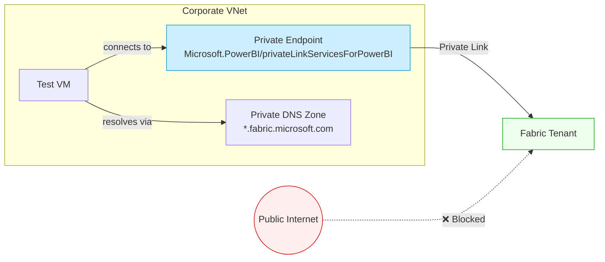

---

## Scenario 2 — Workspace-Level Private Link (Inbound)

### Description

Validate that a client can reach a **specific Fabric workspace** through a workspace-scoped private endpoint, providing more granular access control than the tenant-level link. The test confirms that the workspace API endpoint resolves to a private IP and that workspace artifacts (Lakehouses, Notebooks, etc.) are reachable only from the VNet.

### Functionality Under Test

- `Microsoft.Fabric/privateLinkServicesForFabric` resource deployment (workspace-scoped)
- Workspace-specific DNS resolution (e.g., `<workspaceId>.z4b.w.api.fabric.microsoft.com`)
- Granular inbound access at the workspace level

### Minimum Required Components

| Component | Details |
|---|---|
| Fabric Workspace | Assigned to a Fabric capacity |
| Azure Virtual Network | Subnet for the private endpoint |
| Private Endpoint | Targeting `Microsoft.Fabric/privateLinkServicesForFabric` with the workspace ID |
| Private DNS Zone | For workspace-specific FQDN resolution |
| Test VM | Inside the VNet |

### Diagram

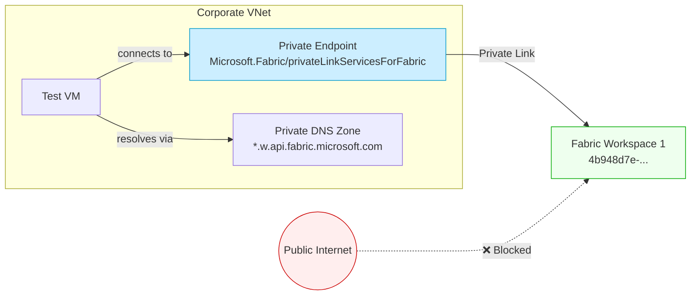

---

## Scenario 3 — Workspace Isolation via Separate Private Links

### Description

Validate that **two workspaces** configured with individual private link services can be accessed independently from different VNets or subnets, ensuring network-level isolation between workspaces. A client in VNet A should reach Workspace 1 but **not** Workspace 2, and vice versa.

### Functionality Under Test

- Workspace-level private link isolation
- Cross-workspace access prevention
- Independent DNS resolution per workspace

### Minimum Required Components

| Component | Details |
|---|---|
| Fabric Workspace 1 | With its own Private Link Service |
| Fabric Workspace 2 | With its own Private Link Service |
| Azure VNet A | Subnet + private endpoint for Workspace 1 |
| Azure VNet B | Subnet + private endpoint for Workspace 2 |
| Private DNS Zones | Separate resolution per workspace |
| 2 Test VMs | One in each VNet |

### Diagram

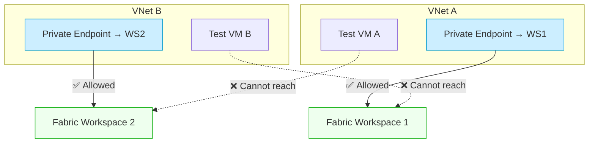

---

## Scenario 4 — Managed Private Endpoint to Azure Storage (Outbound)

### Description

From a **Spark Notebook** in a Fabric workspace with outbound access protection enabled, validate connectivity to an **Azure Blob Storage account** whose public access is disabled. The Managed Private Endpoint (MPE) should be created, approved, and used to read/write data via the Spark runtime.

### Functionality Under Test

- Managed Private Endpoint creation and approval workflow
- Workspace outbound access protection for Data Engineering workloads
- Spark Notebook read/write to private Azure Storage

### Minimum Required Components

| Component | Details |
|---|---|
| Fabric Workspace | With outbound access protection **enabled** |
| Fabric Capacity | In a region that supports MPE |
| Azure Storage Account | With public network access **disabled** |
| Managed Private Endpoint | Targeting `Microsoft.Storage/storageAccounts` |
| Spark Notebook | To read/write data to the storage account |

### Diagram

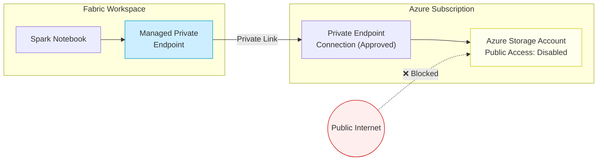

---

## Scenario 5 — Managed Private Endpoint to Azure SQL via Spark JDBC (Outbound)

### Description

From a **Spark Notebook**, write data to an **Azure SQL Database** over JDBC through a Managed Private Endpoint. The SQL Server has public access disabled. This validates the end-to-end private connectivity path for structured data writes from Spark.

### Functionality Under Test

- MPE to `Microsoft.Sql/servers`
- Spark JDBC driver connectivity over private link
- TLS encryption and certificate validation (`*.database.windows.net`)
- DataFrame write operations to Azure SQL

### Minimum Required Components

| Component | Details |
|---|---|
| Fabric Workspace | With outbound access protection enabled |
| Fabric Capacity | In a region supporting MPE |
| Azure SQL Server + Database | Public network access **disabled** |
| Managed Private Endpoint | Targeting `Microsoft.Sql/servers` |
| Spark Notebook | Using JDBC to write data (e.g., `4-spark-jdbc-sql-sample.py`) |

### Diagram

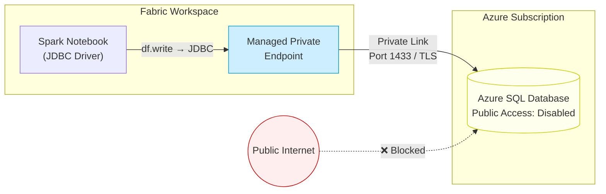

---

## Scenario 6 — Outbound Access Protection Enforcement

### Description

Verify that when **outbound access protection** is enabled on a workspace, Spark workloads **cannot** reach external resources that do not have an approved Managed Private Endpoint. This is the negative test — confirming that unauthorized outbound traffic is blocked.

### Functionality Under Test

- Outbound access protection policy enforcement
- Blocking of unapproved outbound connections from Spark
- Verification that only MPE-approved destinations are reachable

### Minimum Required Components

| Component | Details |
|---|---|
| Fabric Workspace | With outbound access protection **enabled** |
| Fabric Capacity | In a supported region |
| Azure Storage Account (Authorized) | With an approved MPE |
| Azure Storage Account (Unauthorized) | **No** MPE configured |
| Spark Notebook | Attempting to access both accounts |

### Diagram

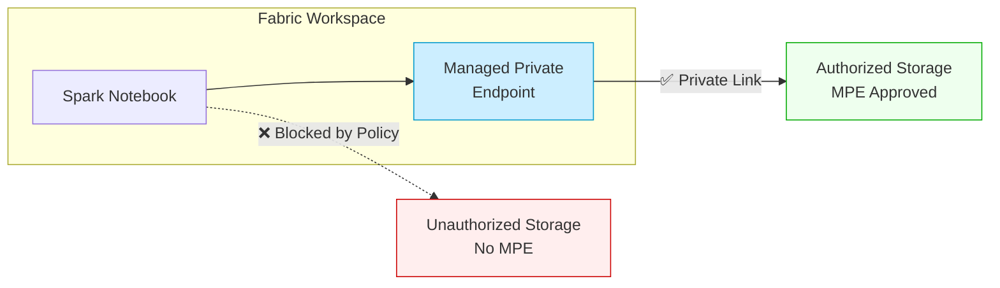

---

## Scenario 7 — VNet Data Gateway for Pipeline Data Movement

### Description

Deploy a **VNet Data Gateway** within an Azure-managed virtual network and use it from a **Fabric Data Factory pipeline** to copy data from a private Azure SQL Database to a Fabric Lakehouse. This validates the gateway-based path when Copy Data activities cannot leverage MPE directly.

### Functionality Under Test

- VNet Data Gateway deployment and registration
- Data Factory Copy Activity over private network
- Gateway-mediated connectivity to private Azure SQL
- Data landing in Fabric Lakehouse

### Minimum Required Components

| Component | Details |
|---|---|
| Azure Virtual Network | With a dedicated subnet for the gateway |
| VNet Data Gateway | Deployed into the VNet |
| Azure SQL Server + Database | Public access disabled; private endpoint in the VNet |
| Fabric Workspace | With a Data Factory pipeline |
| Fabric Lakehouse | As the data destination |
| Data Factory Pipeline | Copy Activity using the VNet Data Gateway |

### Diagram

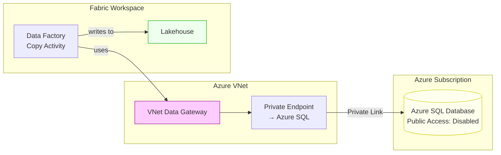

---

## Scenario 8 — On-Premises Data Gateway

### Description

Install an **On-Premises Data Gateway** on a server within a corporate network and validate that Fabric Data Factory can copy data from an **on-premises SQL Server** to a Fabric Lakehouse. This tests the traditional hybrid connectivity pattern.

### Functionality Under Test

- On-Premises Data Gateway installation and registration
- Gateway connectivity from Fabric cloud service to on-prem network
- Data Factory Copy Activity through the gateway
- Authentication and encryption over the gateway channel

### Minimum Required Components

| Component | Details |
|---|---|
| On-Premises Server | Windows machine with gateway software installed |
| On-Premises SQL Server | e.g., `onprem-sqlvm.onprem.contoso.corp` |
| On-Premises Data Gateway | Registered in the Fabric tenant |
| Fabric Workspace | With a Data Factory pipeline |
| Fabric Lakehouse | As the data destination |
| Network Connectivity | Outbound HTTPS from gateway server to Azure Service Bus |

### Diagram

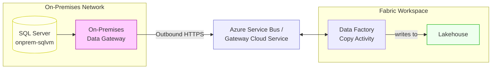

---

## Scenario 9 — Private Link Service to On-Premises Resources

### Description

Set up an **Azure Private Link Service** fronting an on-premises resource (exposed through an Azure Load Balancer and site-to-site VPN / ExpressRoute). Fabric accesses this resource via a Managed Private Endpoint that targets the Private Link Service. This validates the full hybrid chain without exposing on-prem resources to the internet.

### Functionality Under Test

- Azure Private Link Service deployment
- Site-to-site VPN or ExpressRoute hybrid connectivity
- MPE from Fabric to a custom Private Link Service
- End-to-end private data flow from Fabric to on-premises

### Minimum Required Components

| Component | Details |
|---|---|
| On-Premises Network | With VPN/ExpressRoute connectivity to Azure |
| Azure VNet | Hub VNet peered or connected to on-prem |
| Azure Load Balancer (Standard) | Fronting the on-prem backend |
| Azure Private Link Service | Attached to the load balancer |
| Fabric Workspace | With outbound access protection enabled |
| Managed Private Endpoint | Targeting the Private Link Service |
| Spark Notebook or Pipeline | To test data access |

### Diagram

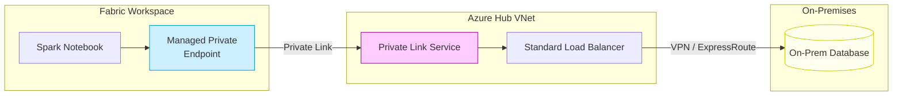

---

## Scenario 10 — DNS Resolution Validation for Private Endpoints

### Description

Verify that private DNS zones are correctly configured so that Fabric FQDNs resolve to **private IPs** from within the VNet, and to **public IPs** from outside. This is a foundational test that underpins all private endpoint scenarios.

### Functionality Under Test

- Private DNS zone configuration and VNet linking
- FQDN-to-private-IP resolution for tenant and workspace endpoints
- Split-horizon DNS behavior (private vs. public resolution)

### Minimum Required Components

| Component | Details |
|---|---|
| Azure Private DNS Zones | For `*.fabric.microsoft.com`, `*.analysis.windows.net`, etc. |
| Azure Virtual Network | Linked to the private DNS zones |
| Private Endpoints | At least one tenant or workspace private endpoint |
| Test VM (inside VNet) | To run `nslookup` / `Resolve-DnsName` |
| Test machine (outside VNet) | To compare public DNS resolution |

### Diagram

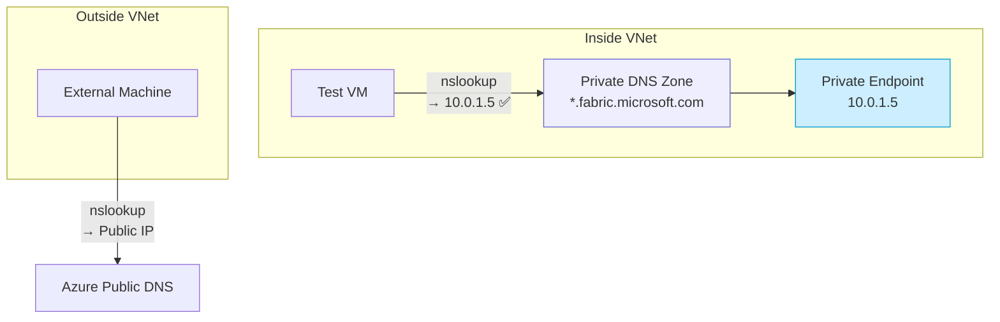

### Expected Results

| Query Source | FQDN | Expected Resolution |
|---|---|---|
| Inside VNet | `<workspaceId>.z4b.w.api.fabric.microsoft.com` | Private IP (e.g., `10.0.1.5`) |
| Outside VNet | `<workspaceId>.z4b.w.api.fabric.microsoft.com` | Public IP |

---

## Scenario 11 — Data Factory Copy Activity with Private Sources

### Description

Test Data Factory **Copy Data activity** against a private Azure SQL Database. Since Data Factory workloads use **Data Connection Rules** (not MPE), this scenario validates the correct governance path and the requirement for a gateway when the source has public access disabled.

### Functionality Under Test

- Data Connection Rules governance for Data Factory
- Copy Activity behavior when source has public access disabled
- Gateway requirement validation (Copy Data does not natively use MPE)
- Successful data copy via VNet Data Gateway or On-Prem Gateway

### Minimum Required Components

| Component | Details |
|---|---|
| Fabric Workspace | With a Data Factory pipeline |
| Azure SQL Database | Public access **disabled** |
| VNet Data Gateway or On-Prem Gateway | Required for private connectivity |
| Fabric Lakehouse or Warehouse | As the data destination |
| Data Connection Rule | Configured in workspace settings |

### Diagram

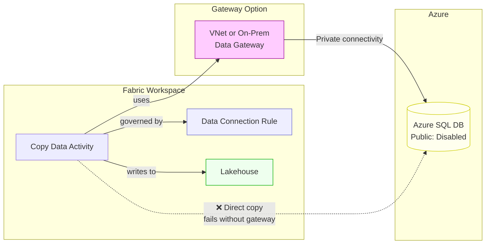

---

## Scenario 12 — Public Network Access Denied with Private-Only Connectivity

### Description

End-to-end validation that when both **inbound** (tenant/workspace private links) and **outbound** (workspace outbound access protection + MPE) are configured, the entire data flow occurs exclusively over private networks. No traffic traverses the public internet.

### Functionality Under Test

- Combined inbound + outbound private networking
- Tenant admin setting: "Block Public Internet Access"
- Workspace outbound access protection
- Full private data path validation

### Minimum Required Components

| Component | Details |
|---|---|
| Fabric Tenant | "Block Public Internet Access" **enabled** |
| Fabric Workspace | Outbound access protection **enabled** |
| Tenant Private Endpoint | For inbound user access |
| Workspace Private Endpoint | For inbound workspace-specific access |
| Managed Private Endpoint | For outbound access to data sources |
| Azure Storage or SQL | Target with public access disabled |
| Test VM in VNet | For user access via the private endpoint |
| Spark Notebook | For outbound data access |

### Diagram

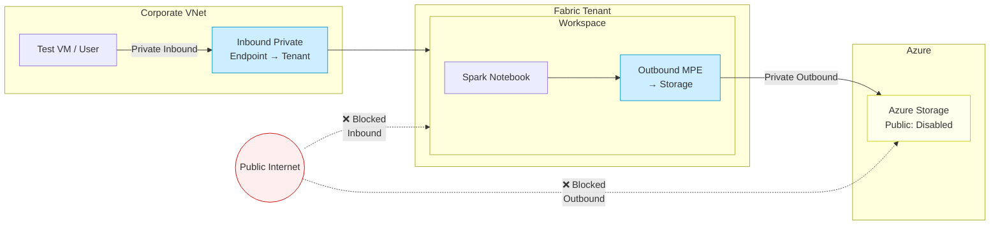

---

## Summary Matrix

| # | Scenario | Direction | Key Feature | Gateway Needed |
|---|---|---|---|---|
| 1 | Tenant-Level Private Link | Inbound | Private Link (PowerBI) | No |
| 2 | Workspace-Level Private Link | Inbound | Private Link (Fabric) | No |
| 3 | Workspace Isolation | Inbound | Multi-workspace isolation | No |
| 4 | MPE to Azure Storage | Outbound | Managed Private Endpoint | No |
| 5 | MPE to Azure SQL (JDBC) | Outbound | MPE + Spark JDBC | No |
| 6 | Outbound Access Protection | Outbound | Policy enforcement | No |
| 7 | VNet Data Gateway | Outbound | VNet Gateway + Pipeline | Yes |
| 8 | On-Premises Data Gateway | Hybrid | On-Prem Gateway | Yes |
| 9 | PLS to On-Premises | Hybrid | Private Link Service + MPE | No (uses MPE) |
| 10 | DNS Resolution | Infra | Split-horizon DNS | No |
| 11 | Copy Activity with Private Sources | Outbound | Data Connection Rules | Yes |
| 12 | Full Private-Only | Both | Combined inbound + outbound | No |
