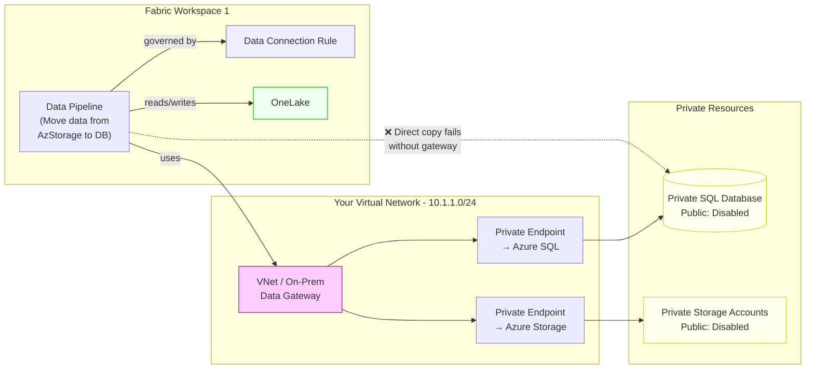
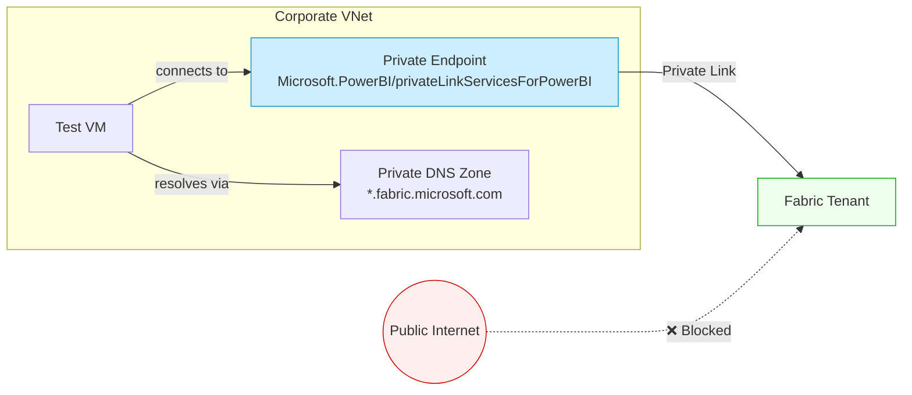
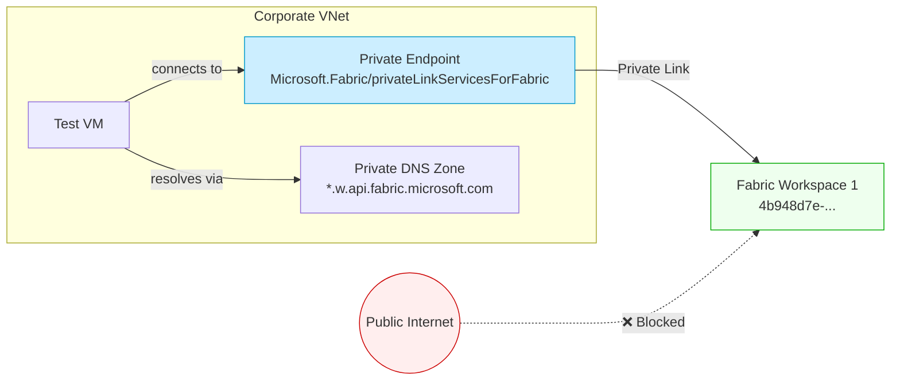
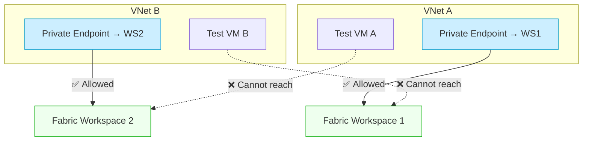
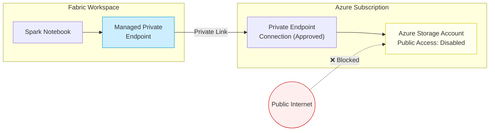
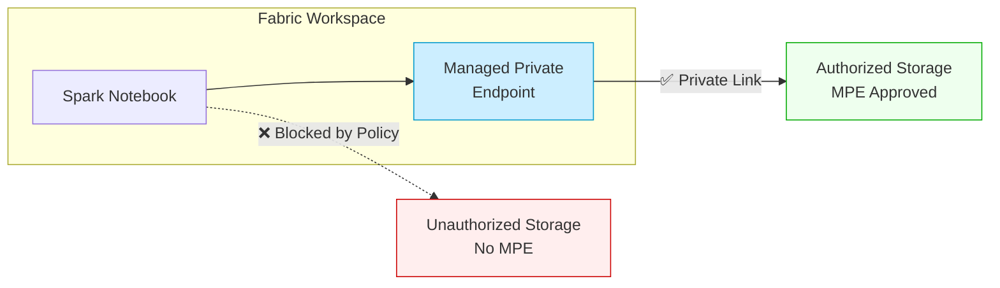
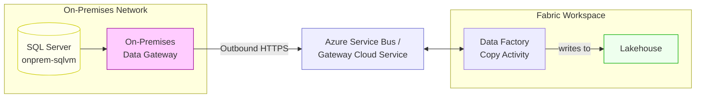
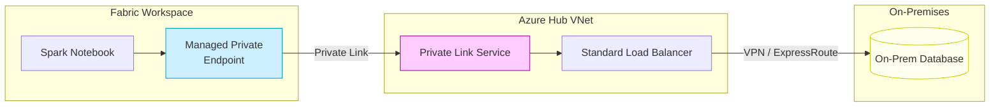
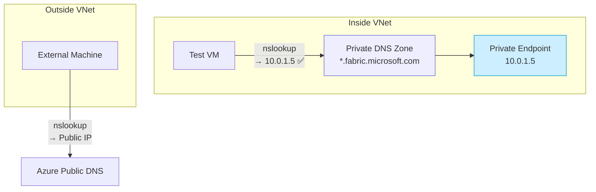

# Microsoft Fabric Network Security — Test Scenarios

This document describes the test scenarios recommended to evaluate the network security functionality of Microsoft Fabric. Each scenario includes a description, the functionality under test, the minimum required components, and an architecture diagram.

---

## Table of Contents

1. [Scenario 1 — Managed Private Endpoint to Private DB from Notebook (+ PLS Direct Connect)](#scenario-1--managed-private-endpoint-to-private-db-from-notebook--pls-direct-connect)
2. [Scenario 2 — Pipeline Data Movement via VNet/On-Prem Data Gateway](#scenario-2--pipeline-data-movement-via-vneton-prem-data-gateway)
3. [Scenario 3 — Tenant-Level + Workspace-Level Private Endpoints with Internet Restriction](#scenario-3--tenant-level--workspace-level-private-endpoints-with-internet-restriction)
4. [Scenario 4 — Cross-Workspace Data Access via Managed Private Endpoint](#scenario-4--cross-workspace-data-access-via-managed-private-endpoint)
5. [Scenario 5 — Tenant-Level Private Link (Inbound)](#scenario-5--tenant-level-private-link-inbound)
6. [Scenario 6 — Workspace-Level Private Link (Inbound)](#scenario-6--workspace-level-private-link-inbound)
7. [Scenario 7 — Workspace Isolation via Separate Private Links](#scenario-7--workspace-isolation-via-separate-private-links)
8. [Scenario 8 — Managed Private Endpoint to Azure Storage (Outbound)](#scenario-8--managed-private-endpoint-to-azure-storage-outbound)
9. [Scenario 9 — Outbound Access Protection Enforcement](#scenario-9--outbound-access-protection-enforcement)
10. [Scenario 10 — On-Premises Data Gateway](#scenario-10--on-premises-data-gateway)
11. [Scenario 11 — Private Link Service to On-Premises Resources](#scenario-11--private-link-service-to-on-premises-resources)
12. [Scenario 12 — DNS Resolution Validation for Private Endpoints](#scenario-12--dns-resolution-validation-for-private-endpoints)

---

## Scenario 1 — Managed Private Endpoint to Private DB from Notebook (+ PLS Direct Connect)

📋 See also: `scenario01.excalidraw`

### Description

Access private resources from a **Jupyter Notebook** in a Fabric workspace through **Managed Private Endpoints (MPE)**, optionally using **Private Link Service (PLS) Direct Connect**. The notebook reads data from a private Azure SQL Database whose public access is disabled. Two connectivity paths are tested: a traditional MPE targeting `Microsoft.Sql/servers`, and a PLS Direct Connect path where the database is fronted by a Private Link Service in your own virtual network.

### Functionality Under Test

- MPE to `Microsoft.Sql/servers` for direct private database access
- PLS Direct Connect as an alternative connectivity path
- Spark JDBC driver connectivity over private link (port 1433 / TLS)
- Managed Virtual Network integration with Fabric Capacity
- DataFrame read/write operations to Azure SQL via notebook

### Minimum Required Components

| Component | Details |
|---|---|
| Fabric Workspace | With outbound access protection **enabled** |
| Fabric Capacity | In a region supporting MPE (provides Managed Virtual Network) |
| Managed Private Endpoint | Targeting `Microsoft.Sql/servers` |
| Azure SQL Server + Database | Public network access **disabled** |
| Jupyter / Spark Notebook | To read data from the database (e.g., `4-spark-jdbc-sql-sample.py`) |
| Your Virtual Network *(optional, for PLS DC)* | With a subnet (e.g., `10.1.1.0/24`) hosting the PLS |
| Private Link Service Direct Connect *(optional)* | Fronting the private database for the PLS DC path |

### Diagram

```mermaid
flowchart LR
    subgraph Managed Virtual Network
        NB["Jupyter Notebook<br/>(Read from DB)"]
        MPE[Managed Private<br/>Endpoint]
    end

    FC[Fabric Capacity] -.-> |provides| Managed Virtual Network

    subgraph Your Virtual Network
        PLS_DC[Private Link Service<br/>Direct Connect]
    end

    subgraph Azure Subscription
        SQL[(Private SQL Database<br/>Public Access: Disabled)]
    end

    NB --> MPE
    MPE -- "Path 1: Traditional MPE<br/>Private Link / Port 1433" --> SQL
    MPE -- "Path 2: PLS Direct Connect" --> PLS_DC
    PLS_DC --> SQL

    Internet((Public Internet)) -. "❌ Blocked" .-> SQL

    style Internet fill:#fee,stroke:#c00
    style MPE fill:#cef,stroke:#09c
    style SQL fill:#ffe,stroke:#cc0
    style PLS_DC fill:#fcf,stroke:#909
```

### Test Steps

1. Create an MPE targeting the Azure SQL Server and approve the private endpoint connection.
2. From the notebook, connect via JDBC and read data — verify the traditional MPE path works.
3. *(Optional)* Deploy a Private Link Service in your VNet fronting the same database. Create an MPE targeting the PLS and test the Direct Connect path.
4. Confirm that public access to the SQL Server remains blocked throughout.

---

## Scenario 2 — Pipeline Data Movement via VNet/On-Prem Data Gateway

📋 See also: `scenario02.excalidraw`

### Description

Access private resources from a **Data Factory pipeline** through a **VNet Data Gateway** or **On-Premises Data Gateway**. The pipeline moves data between private Azure resources — for example, copying data from a private **Azure Storage account** to a private **Azure SQL Database**, or between either of these and **OneLake**. Since Data Factory Copy Activities use **Data Connection Rules** (not MPE), a gateway is required when sources/destinations have public access disabled. Additionally, test the impact of disabling internet access at the workspace or tenant level on pipeline execution.

### Functionality Under Test

- VNet Data Gateway deployment and registration (preferred — easier to provision)
- On-Premises Data Gateway as an alternative connectivity path
- Data Factory Copy Activity over private network via gateway
- Data Connection Rules governance for Data Factory
- Data movement between private Azure SQL, Azure Storage, and OneLake
- Impact of disabling internet access on pipeline execution

### Minimum Required Components

| Component | Details |
|---|---|
| Fabric Workspace | With a Data Factory pipeline |
| Your Virtual Network | Subnet (e.g., `10.1.1.0/24`) for gateway and private endpoints |
| VNet Data Gateway or On-Prem Gateway | Deployed into the VNet / on-premises network |
| Azure SQL Server + Database | Public access **disabled**; private endpoint in the VNet |
| Azure Storage Account(s) | Public access **disabled**; private endpoint in the VNet |
| OneLake | As a source or destination for data movement |
| Data Factory Pipeline | Copy Activity using the gateway |
| Data Connection Rule | Configured in workspace settings |

### Diagram



### Test Steps

1. Deploy the VNet Data Gateway (or install an On-Premises Data Gateway) and register it in the Fabric tenant.
2. Create a pipeline that copies data from Azure Storage to Azure SQL (or vice versa) through the gateway.
3. Verify the pipeline succeeds with the gateway in place.
4. **Disable internet access** in Workspace 1 (or at the tenant level) and re-run the pipeline — verify it still works through the private path.
5. Attempt a direct Copy Activity without the gateway and confirm it fails.

---

## Scenario 3 — Tenant-Level + Workspace-Level Private Endpoints with Internet Restriction

📋 See also: `scenario03.excalidraw`

### Description

Validate the combined behavior of **tenant-level private endpoints** and **workspace-level private endpoints** when public internet access is restricted. This scenario deploys two workspaces, each with its own private endpoint and VNet, and tests inbound connectivity from virtual desktops. The key test is the **impact of restricting internet access** at the tenant or workspace level — confirming that private endpoint access continues to work while public access is blocked. No resources (Lakehouses, Notebooks, etc.) are required inside the workspaces; the test focuses purely on connectivity and DNS resolution.

### Functionality Under Test

- `Microsoft.PowerBI/privateLinkServicesForPowerBI` (tenant-level PE) deployment
- `Microsoft.Fabric/privateLinkServicesForFabric` (workspace-level PE) deployment
- Private DNS zone configuration for both tenant and workspace endpoints
- Tenant admin setting: "Block Public Internet Access"
- Workspace-level internet access restriction
- Combined inbound private networking validation
- Split-horizon DNS behavior from inside vs. outside VNets

### Minimum Required Components

| Component | Details |
|---|---|
| Fabric Tenant | With "Block Public Internet Access" **enabled** |
| Fabric Workspace 1 | With workspace-level Private Link Service |
| Fabric Workspace 2 | With workspace-level Private Link Service |
| VNet A (for Workspace 1) | Subnet (e.g., `10.1.1.0/24`) + tenant PE + workspace PE |
| VNet A (for Workspace 2) | Subnet (e.g., `10.1.1.0/24`) + workspace PE |
| Private Endpoints | Tenant-level PE + workspace-level PEs |
| Private Link Services | For tenant and each workspace |
| Private DNS Zones | For tenant FQDNs and workspace-specific FQDNs |
| Virtual Desktops | One per VNet to validate connectivity |

### Diagram

```mermaid
flowchart TB
    subgraph Fabric Tenant
        WS1[Workspace 1<br/>OneLake1]
        WS2[Workspace 2<br/>OneLake2]
    end

    subgraph VNet A - Workspace 1 Section
        VD1[Virtual Desktop]
        PE_T[PE → Tenant<br/>PLS]
        PE_WS1[PE → Workspace 1<br/>PLS]
        DNS1[Private DNS Zones<br/>Tenant + Workspace]
    end

    subgraph VNet A - Workspace 2 Section
        VD2[Virtual Desktop]
        PE_WS2[PE → Workspace 2<br/>PLS]
        DNS2[Private DNS Zones<br/>Workspace]
    end

    VD1 -- "resolves via" --> DNS1
    VD1 -- "connects to" --> PE_T -- "Private Link" --> Fabric Tenant
    VD1 -- "connects to" --> PE_WS1 -- "Private Link" --> WS1

    VD2 -- "resolves via" --> DNS2
    VD2 -- "connects to" --> PE_WS2 -- "Private Link" --> WS2

    Internet((Public Internet))
    Internet -. "❌ Blocked" .-> WS1
    Internet -. "❌ Blocked" .-> WS2

    style Internet fill:#fee,stroke:#c00
    style PE_T fill:#cef,stroke:#09c
    style PE_WS1 fill:#cef,stroke:#09c
    style PE_WS2 fill:#cef,stroke:#09c
    style WS1 fill:#efe,stroke:#0a0
    style WS2 fill:#efe,stroke:#0a0
```

### Test Steps

1. Deploy tenant-level and workspace-level private endpoints with associated DNS zones.
2. From Virtual Desktop 1, verify access to both the tenant and Workspace 1 via private endpoints.
3. From Virtual Desktop 2, verify access to Workspace 2 via its private endpoint.
4. **Disable internet access** at the tenant level — confirm private endpoint access still works from both VNets.
5. **Disable internet access** at the workspace level for each workspace independently — confirm the same.
6. From outside both VNets, confirm that all access is blocked.

---

## Scenario 4 — Cross-Workspace Data Access via Managed Private Endpoint

📋 See also: `scenario04.excalidraw`

### Description

Test **cross-workspace communication** where a **Jupyter Notebook** in Workspace 1 reads data from **OneLake in Workspace 2** through a **Managed Private Endpoint**. Both workspaces have their own private endpoints and VNets with virtual desktops. This validates whether MPE can be used to access data across workspace boundaries, combining inbound private endpoints (for user access) with outbound MPE (for cross-workspace data access).

### Functionality Under Test

- MPE for cross-workspace OneLake access from a notebook
- Managed Virtual Network integration with Fabric Capacity
- Workspace-level private endpoints for inbound user access
- Private DNS zone resolution for both workspaces
- Cross-workspace data read via Spark/notebook
- Potential VNet/On-Prem Data Gateway support for cross-workspace pipelines

### Minimum Required Components

| Component | Details |
|---|---|
| Fabric Workspace 1 | With outbound access protection enabled; contains a Jupyter Notebook |
| Fabric Workspace 2 | Contains OneLake data to be accessed |
| Fabric Capacity | In a region supporting MPE (provides Managed Virtual Network) |
| Managed Private Endpoint | From Workspace 1 targeting OneLake in Workspace 2 |
| VNet A (for Workspace 1) | Subnet (e.g., `10.1.1.0/24`) + workspace PE + PLS |
| VNet A (for Workspace 2) | Subnet (e.g., `10.1.1.0/24`) + workspace PE + PLS |
| Private DNS Zones | For tenant and workspace-specific FQDNs |
| Virtual Desktops | One per VNet section for inbound access |
| Jupyter / Spark Notebook | In Workspace 1 to read from OneLake2 |

### Diagram

```mermaid
flowchart LR
    subgraph Managed Virtual Network
        NB["Jupyter Notebook<br/>(Read from OneLake2)"]
        MPE[Managed Private<br/>Endpoint]
    end

    FC[Fabric Capacity] -.-> |provides| Managed Virtual Network

    subgraph Workspace 1
        direction TB
        WS1_NB[Notebook Host]
    end

    subgraph Workspace 2
        OL2[OneLake2]
    end

    subgraph VNet A - Workspace 1 Section
        VD1[Virtual Desktop]
        PE_WS1[PE → Workspace 1]
        PLS1[PLS]
        DNS1[DNS Zones]
    end

    subgraph VNet A - Workspace 2 Section
        VD2[Virtual Desktop]
        PE_WS2[PE → Workspace 2]
        PLS2[PLS]
        DNS2[DNS Zones]
    end

    VD1 --> PE_WS1 -- "Private Link" --> Workspace 1
    VD2 --> PE_WS2 -- "Private Link" --> Workspace 2

    NB --> MPE -- "Cross-workspace<br/>Private Link" --> OL2

    style MPE fill:#cef,stroke:#09c
    style PE_WS1 fill:#cef,stroke:#09c
    style PE_WS2 fill:#cef,stroke:#09c
    style OL2 fill:#efe,stroke:#0a0
    style PLS1 fill:#fcf,stroke:#909
    style PLS2 fill:#fcf,stroke:#909
```

### Test Steps

1. Deploy workspace-level private endpoints for both Workspace 1 and Workspace 2.
2. Place sample data in OneLake2 (Workspace 2).
3. Create an MPE in Workspace 1 targeting OneLake in Workspace 2.
4. From the Jupyter Notebook in Workspace 1, attempt to read data from OneLake2 — verify cross-workspace access via MPE.
5. *(Optional)* Test whether VNet/On-Prem Data Gateways support cross-workspace pipeline scenarios.

---

## Scenario 5 — Tenant-Level Private Link (Inbound)

📋 No Excalidraw diagram for this scenario.

### Description

Validate that a client inside a corporate virtual network can reach the Fabric tenant endpoint exclusively through a **tenant-level private endpoint**, and that public internet access to the tenant is blocked when the tenant setting restricts it.

### Functionality Under Test

- `Microsoft.PowerBI/privateLinkServicesForPowerBI` resource deployment
- Private DNS zone resolution (`*.analysis.windows.net`, `*.pbidedicated.windows.net`, `*.fabric.microsoft.com`)
- Tenant-wide inbound private connectivity

### Minimum Required Components

| Component | Details |
|---|---|
| Fabric Tenant | With Private Link enabled in Admin Portal |
| Azure Virtual Network | At least one subnet for the private endpoint |
| Private Endpoint | Targeting `Microsoft.PowerBI/privateLinkServicesForPowerBI` |
| Private DNS Zones | For Fabric / Power BI FQDN resolution |
| Test VM | Inside the VNet to validate connectivity |

### Diagram



---

## Scenario 6 — Workspace-Level Private Link (Inbound)

📋 No Excalidraw diagram for this scenario.

### Description

Validate that a client can reach a **specific Fabric workspace** through a workspace-scoped private endpoint, providing more granular access control than the tenant-level link. The test confirms that the workspace API endpoint resolves to a private IP and that workspace artifacts (Lakehouses, Notebooks, etc.) are reachable only from the VNet.

### Functionality Under Test

- `Microsoft.Fabric/privateLinkServicesForFabric` resource deployment (workspace-scoped)
- Workspace-specific DNS resolution (e.g., `<workspaceId>.z4b.w.api.fabric.microsoft.com`)
- Granular inbound access at the workspace level

### Minimum Required Components

| Component | Details |
|---|---|
| Fabric Workspace | Assigned to a Fabric capacity |
| Azure Virtual Network | Subnet for the private endpoint |
| Private Endpoint | Targeting `Microsoft.Fabric/privateLinkServicesForFabric` with the workspace ID |
| Private DNS Zone | For workspace-specific FQDN resolution |
| Test VM | Inside the VNet |

### Diagram



---

## Scenario 7 — Workspace Isolation via Separate Private Links

📋 No Excalidraw diagram for this scenario.

### Description

Validate that **two workspaces** configured with individual private link services can be accessed independently from different VNets or subnets, ensuring network-level isolation between workspaces. A client in VNet A should reach Workspace 1 but **not** Workspace 2, and vice versa.

### Functionality Under Test

- Workspace-level private link isolation
- Cross-workspace access prevention
- Independent DNS resolution per workspace

### Minimum Required Components

| Component | Details |
|---|---|
| Fabric Workspace 1 | With its own Private Link Service |
| Fabric Workspace 2 | With its own Private Link Service |
| Azure VNet A | Subnet + private endpoint for Workspace 1 |
| Azure VNet B | Subnet + private endpoint for Workspace 2 |
| Private DNS Zones | Separate resolution per workspace |
| 2 Test VMs | One in each VNet |

### Diagram



---

## Scenario 8 — Managed Private Endpoint to Azure Storage (Outbound)

📋 No Excalidraw diagram for this scenario.

### Description

From a **Spark Notebook** in a Fabric workspace with outbound access protection enabled, validate connectivity to an **Azure Blob Storage account** whose public access is disabled. The Managed Private Endpoint (MPE) should be created, approved, and used to read/write data via the Spark runtime.

### Functionality Under Test

- Managed Private Endpoint creation and approval workflow
- Workspace outbound access protection for Data Engineering workloads
- Spark Notebook read/write to private Azure Storage

### Minimum Required Components

| Component | Details |
|---|---|
| Fabric Workspace | With outbound access protection **enabled** |
| Fabric Capacity | In a region that supports MPE |
| Azure Storage Account | With public network access **disabled** |
| Managed Private Endpoint | Targeting `Microsoft.Storage/storageAccounts` |
| Spark Notebook | To read/write data to the storage account |

### Diagram



---

## Scenario 9 — Outbound Access Protection Enforcement

📋 No Excalidraw diagram for this scenario.

### Description

Verify that when **outbound access protection** is enabled on a workspace, Spark workloads **cannot** reach external resources that do not have an approved Managed Private Endpoint. This is the negative test — confirming that unauthorized outbound traffic is blocked.

### Functionality Under Test

- Outbound access protection policy enforcement
- Blocking of unapproved outbound connections from Spark
- Verification that only MPE-approved destinations are reachable

### Minimum Required Components

| Component | Details |
|---|---|
| Fabric Workspace | With outbound access protection **enabled** |
| Fabric Capacity | In a supported region |
| Azure Storage Account (Authorized) | With an approved MPE |
| Azure Storage Account (Unauthorized) | **No** MPE configured |
| Spark Notebook | Attempting to access both accounts |

### Diagram



---

## Scenario 10 — On-Premises Data Gateway

📋 No Excalidraw diagram for this scenario.

### Description

Install an **On-Premises Data Gateway** on a server within a corporate network and validate that Fabric Data Factory can copy data from an **on-premises SQL Server** to a Fabric Lakehouse. This tests the traditional hybrid connectivity pattern.

### Functionality Under Test

- On-Premises Data Gateway installation and registration
- Gateway connectivity from Fabric cloud service to on-prem network
- Data Factory Copy Activity through the gateway
- Authentication and encryption over the gateway channel

### Minimum Required Components

| Component | Details |
|---|---|
| On-Premises Server | Windows machine with gateway software installed |
| On-Premises SQL Server | e.g., `onprem-sqlvm.onprem.contoso.corp` |
| On-Premises Data Gateway | Registered in the Fabric tenant |
| Fabric Workspace | With a Data Factory pipeline |
| Fabric Lakehouse | As the data destination |
| Network Connectivity | Outbound HTTPS from gateway server to Azure Service Bus |

### Diagram



---

## Scenario 11 — Private Link Service to On-Premises Resources

📋 No Excalidraw diagram for this scenario.

### Description

Set up an **Azure Private Link Service** fronting an on-premises resource (exposed through an Azure Load Balancer and site-to-site VPN / ExpressRoute). Fabric accesses this resource via a Managed Private Endpoint that targets the Private Link Service. This validates the full hybrid chain without exposing on-prem resources to the internet.

### Functionality Under Test

- Azure Private Link Service deployment
- Site-to-site VPN or ExpressRoute hybrid connectivity
- MPE from Fabric to a custom Private Link Service
- End-to-end private data flow from Fabric to on-premises

### Minimum Required Components

| Component | Details |
|---|---|
| On-Premises Network | With VPN/ExpressRoute connectivity to Azure |
| Azure VNet | Hub VNet peered or connected to on-prem |
| Azure Load Balancer (Standard) | Fronting the on-prem backend |
| Azure Private Link Service | Attached to the load balancer |
| Fabric Workspace | With outbound access protection enabled |
| Managed Private Endpoint | Targeting the Private Link Service |
| Spark Notebook or Pipeline | To test data access |

### Diagram



---

## Scenario 12 — DNS Resolution Validation for Private Endpoints

📋 No Excalidraw diagram for this scenario.

### Description

Verify that private DNS zones are correctly configured so that Fabric FQDNs resolve to **private IPs** from within the VNet, and to **public IPs** from outside. This is a foundational test that underpins all private endpoint scenarios.

### Functionality Under Test

- Private DNS zone configuration and VNet linking
- FQDN-to-private-IP resolution for tenant and workspace endpoints
- Split-horizon DNS behavior (private vs. public resolution)

### Minimum Required Components

| Component | Details |
|---|---|
| Azure Private DNS Zones | For `*.fabric.microsoft.com`, `*.analysis.windows.net`, etc. |
| Azure Virtual Network | Linked to the private DNS zones |
| Private Endpoints | At least one tenant or workspace private endpoint |
| Test VM (inside VNet) | To run `nslookup` / `Resolve-DnsName` |
| Test machine (outside VNet) | To compare public DNS resolution |

### Diagram



### Expected Results

| Query Source | FQDN | Expected Resolution |
|---|---|---|
| Inside VNet | `<workspaceId>.z4b.w.api.fabric.microsoft.com` | Private IP (e.g., `10.0.1.5`) |
| Outside VNet | `<workspaceId>.z4b.w.api.fabric.microsoft.com` | Public IP |

---

## Summary Matrix

| # | Scenario | Direction | Key Feature | Gateway Needed |
|---|---|---|---|---|
| 1 | MPE to Private DB from Notebook (+ PLS DC) | Outbound | MPE + PLS Direct Connect | No |
| 2 | Pipeline via VNet/On-Prem Data Gateway | Outbound | VNet/On-Prem Gateway + Pipeline | Yes |
| 3 | Tenant + Workspace PE with Internet Restriction | Inbound | Combined PE + internet block | No |
| 4 | Cross-Workspace Data Access via MPE | Cross-workspace | MPE + OneLake | No |
| 5 | Tenant-Level Private Link | Inbound | Private Link (PowerBI) | No |
| 6 | Workspace-Level Private Link | Inbound | Private Link (Fabric) | No |
| 7 | Workspace Isolation | Inbound | Multi-workspace isolation | No |
| 8 | MPE to Azure Storage | Outbound | Managed Private Endpoint | No |
| 9 | Outbound Access Protection | Outbound | Policy enforcement | No |
| 10 | On-Premises Data Gateway | Hybrid | On-Prem Gateway | Yes |
| 11 | PLS to On-Premises | Hybrid | Private Link Service + MPE | No (uses MPE) |
| 12 | DNS Resolution | Infra | Split-horizon DNS | No |
